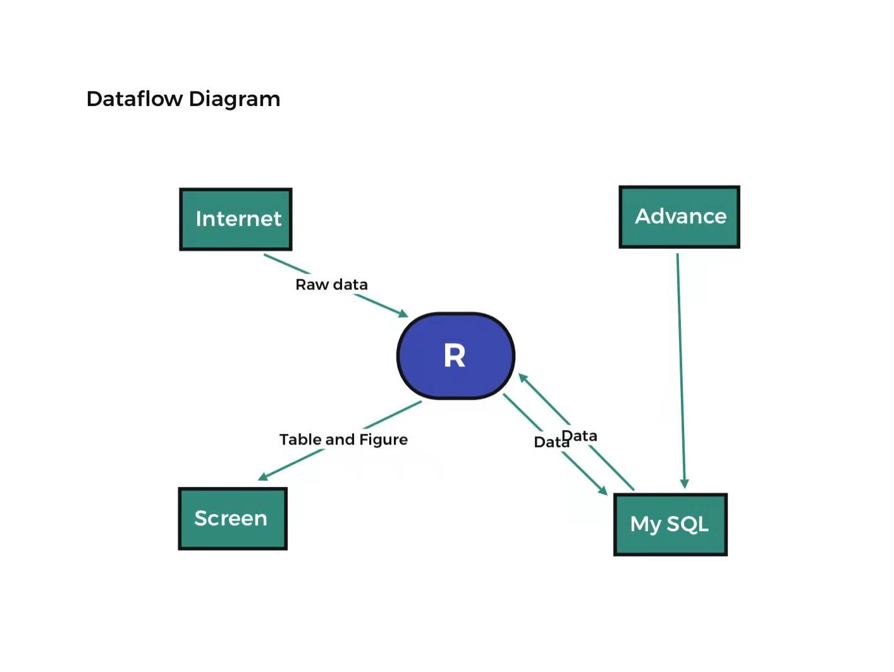
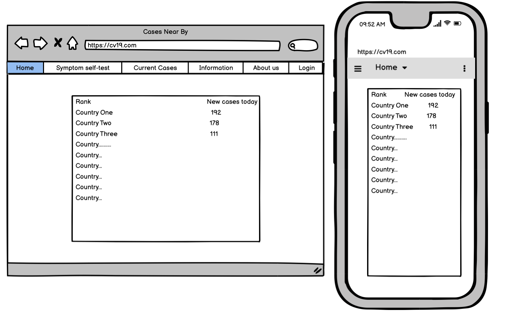
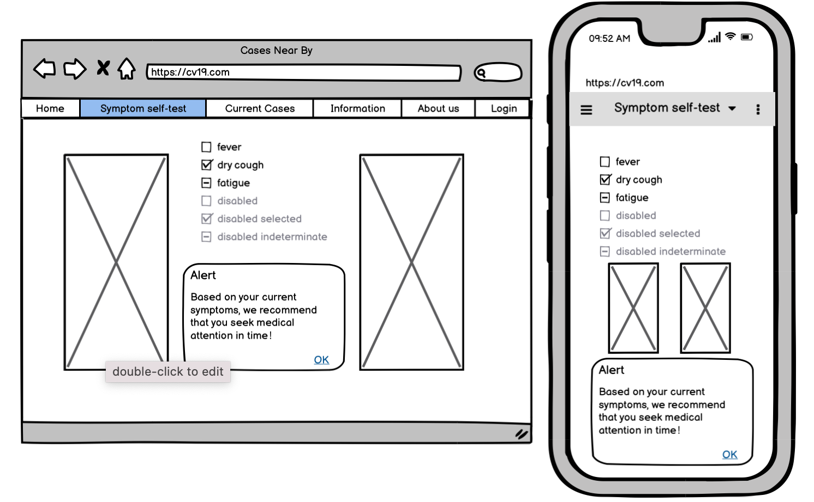
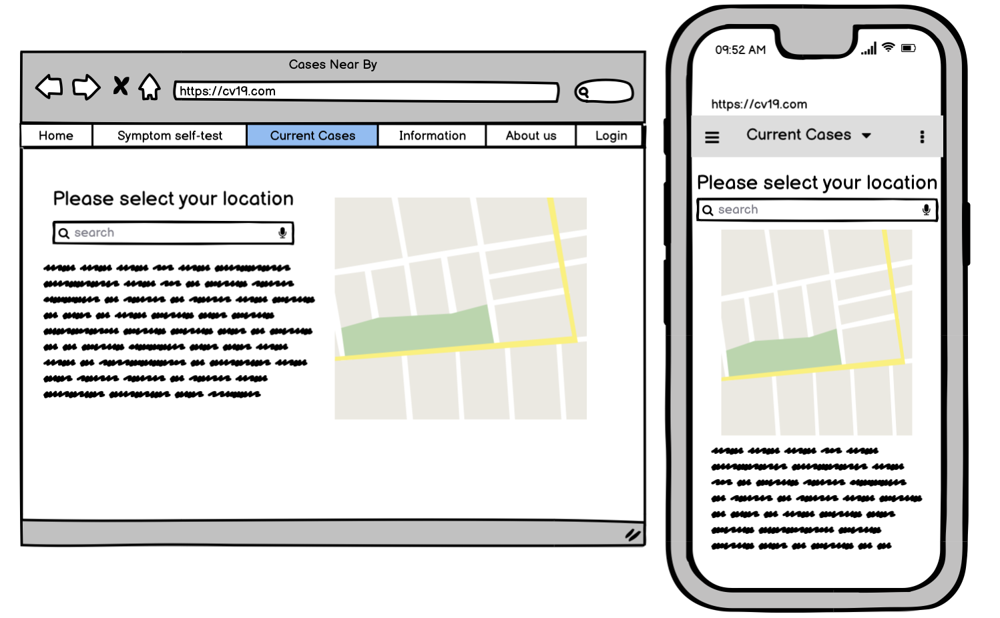
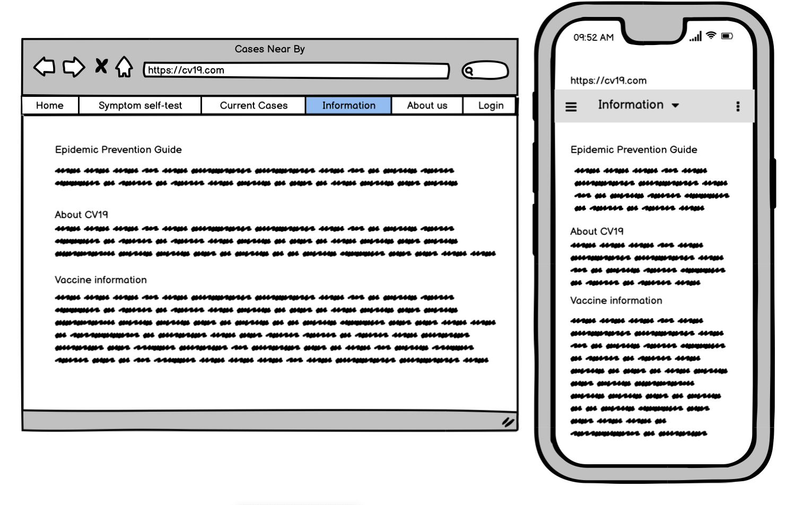
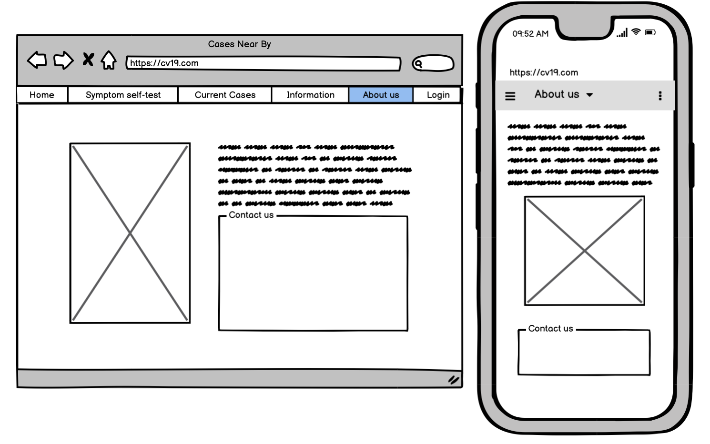
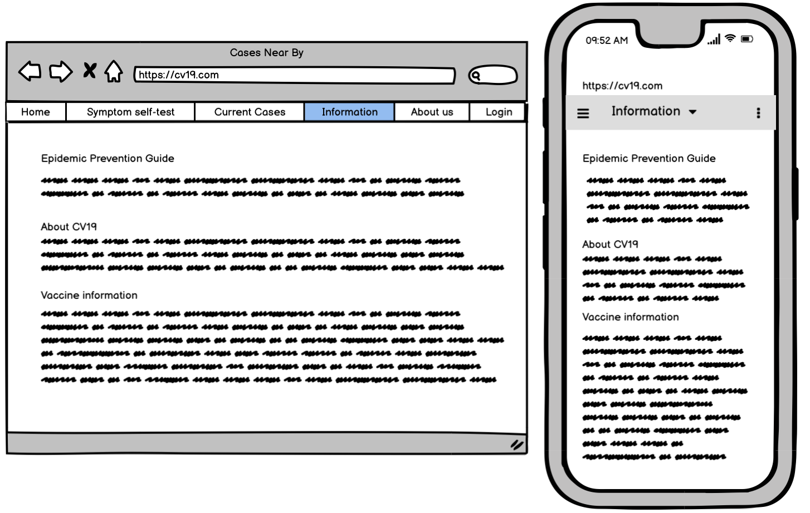
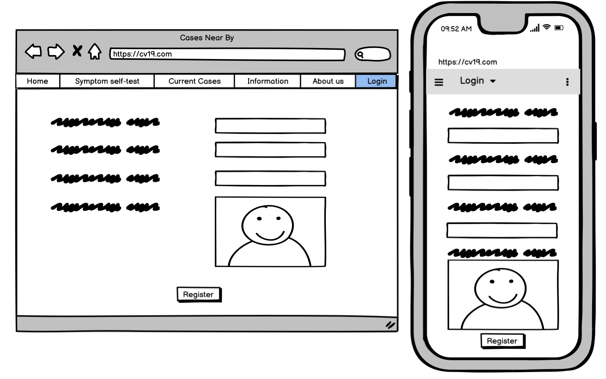
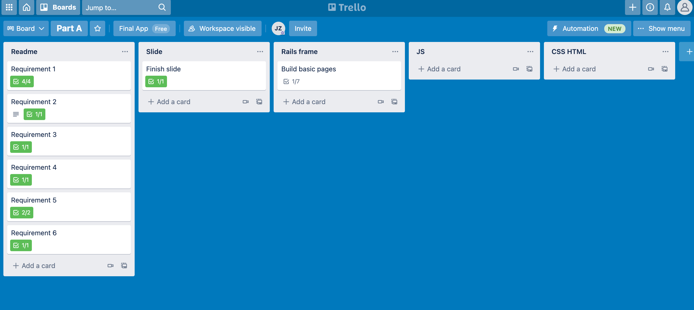

# Cases Near By
## JING ZHAO
https://github.com/jingzhao-git/sale_center
https://cv19market.herokuapp.com/

------------------------------------------------

## Purpose 

At the beginning of 2020, the COVID-19 virus broke out in Wuhan, Hubei, and then quickly swept the world, bringing huge disasters, losses and life threats to various countries and families. As of August 1, 2021, there are 198,900,735 cases of COVID-19 worldwide, and 4,238,544 deaths.
Nowadays, although a vaccine for COVID-19 has been developed, the mutation characteristics of COVID0-19 make the vaccines of many companies pale in the face of the virus, and because some vaccines have side effects, the best way is to protect yourself. Here, we hope to provide an APP to help users better and more timely understand COVID-19 so as to provide better protection.

## Functionality/featrues

### News

In this section, we provide the daily number of new infections, deaths and cures of COVID-19 globally, in a country, and in a state (province). At the same time, in order for users to have a more intuitive understanding, we will use charts to show these results. In addition, we also provide links to some of the latest reports on COVID-19.

### Purchase anti-epidemic products

Purchase anti-epidemic products
During the epidemic, many anti-epidemic products are difficult to buy through channels. Masks and disinfectant are often out of stock in supermarkets. People are also more inclined to buy such products online. Our website provides a dedicated platform for everyone.

### Information

In this section, we will provide some advice on the prevention of covid-19. For example, how can we protect ourselves outdoors from COVID-19 and what preventive measures are there. In addition, how to obtain COVID-19 testing, how to obtain vaccine protection, how to isolate at home, what sequelae of COVID-19, etc.

### About us

In this section, we mainly introduce ourselves and give our contact information. Hope that more enthusiastic people can join us to improve this app. At the same time, it is more important to hope that users can provide valuable comments and criticisms so that we can improve the APP.

## Target audience 

This app is aimed at people in areas affected by the epidemic and those interested in knowledge about the epidemic, so that people can do a good job of prevention. It can let them know the local epidemic situation in time and make relevant arrangements whether to go out. It can also provide more basic knowledge about Covid 19 such as self-screening based on symptoms.

## Tech stack

**1. Lunix**

We need to use a virtualizer to deploy the software, and generally speaking, the most common system on the virtualizer is Lunix. In other words, we need to use the Lunix system to build the entire app.

**2. Rails**

With the help of R, we can use it to build APPs, and at the same time, we can use R to implement web crawling to obtain new information. In addition, you can also use R's powerful statistics and graphing functions for data processing and processing.

**3. Mysql**

After we obtain the data, we need to store this information. MySQL is the most popular relational database management system. In terms of web applications, MySQL is one of the best RDBMS (Relational Database Management System) application software. So we will use mysql to store the data. At the same time, R can access SQL data very friendly.

**4. JavaScript **

The APP we build needs to achieve a certain amount of interaction, and Javascript is a good choice. JavaScript ("JS" for short) is a lightweight, interpreted or just-in-time compiled programming language with function first. Although it is famous as a scripting language for developing Web pages, it is also used in many non-browser environments. JavaScript is based on prototype programming, a multi-paradigm dynamic scripting language, and supports object-oriented, imperative, declarative, and function Programming paradigm.

   - 1) Embed dynamic text in HTML page.
   - 2) Respond to browser events.
   - 3) Read and write HTML elements.
   - 4) Verify the data before it is submitted to the server.
   - 5) Detect visitor's browser information, control cookies, including creation and modification, etc.
 
**5. html + css**

These two languages are used to write the front end to bring the most basic visual experience to the website

## Dataflow Diagram

## Application Architecture Diagram

## User Stories
As a resident in an epidemic-affected area, I need to understand the epidemic situation in the surrounding area in order to take preventive measures.
## Wirefirames

## Trello

